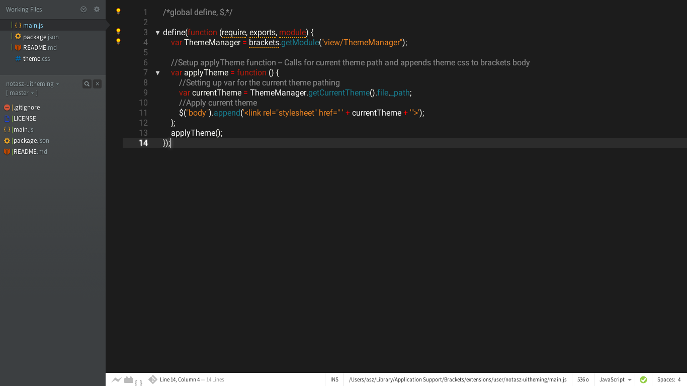
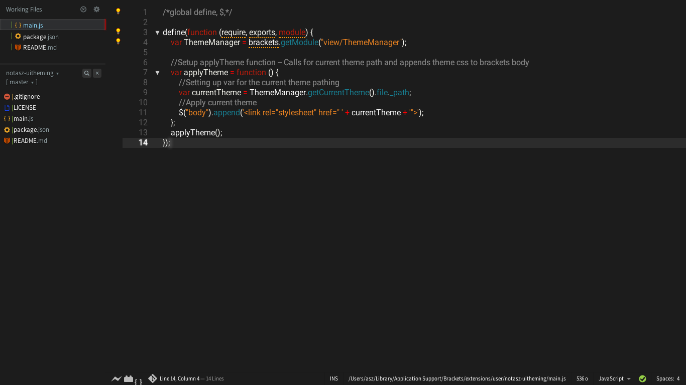

Brackets UI Theming Enable
===

A simple extension to allow native theme developers to include CSS code to style all available UI elements in Brackets. 
Brackets themes available via the extension registry cannot currently theme outside of the editor, but this extension solves that. Using this extension, any theme developer can include CSS code to style any UI element available in Brackets. If the user does not have this extension, the extra CSS code will be ignored and the Editor will still be themed as normal.

Screenshots
---
Without enabler [Midnight Glow](https://github.com/notasz/Brackets-Midnightglow) looks like this:

With enabler [Midnight Glow](https://github.com/notasz/Brackets-Midnightglow) looks like this:

Notes
---
- Please note that the Brackets developers have not included UI theming because it can, and probably will break as Brackets continues development. As such, UI themes are bound to break in future versions and it will be up to the theme developers to keep them up to date as time goes on.
- This does not enable UI themes for Brackets themes that do not include CSS to style the UI. The developer of the theme needs to update the theme to include this code in order for the extension to work.

Known Supported Themes
---
 [Midnight Glow](https://github.com/notasz/Brackets-Midnightglow)
 
Theme Developers
---
Simply include CSS styles for Brackets UI elements in your theme to use this extension. Any user that uses your theme and has this extension will have the UI theming enabled, any user that does not will only have the Editor themed. If your theme supports this extension, please let me know and I will add your theme to the supported themes list.

To do List
---
- Add an option to enable/disable in the Theme modal.

License
---
The MIT License. Read [LICENSE](LICENSE) for further information.